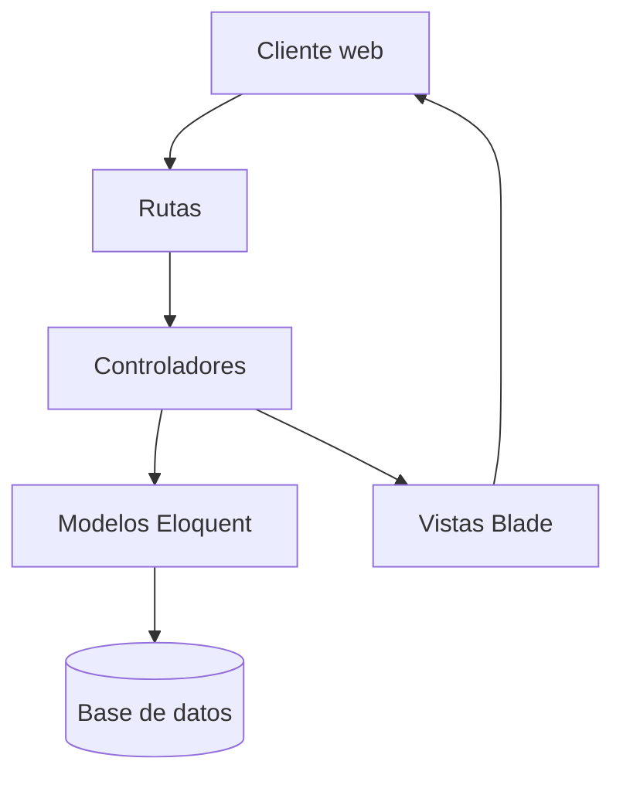

# EmprendeLink

Plataforma web orientada a facilitar la gestión y comercialización de productos ofrecidos por emprendedores, conectándolos con clientes interesados mediante un entorno organizado, accesible y confiable.

Este proyecto se desarrolla para la asignatura **DWS901 - Desarrollo de Aplicaciones Web con Software Interpretado en el Servidor** de la Universidad Don Bosco.

## Estado del proyecto

El proyecto se encuentra en la **Fase 1: Descubrimiento y Arquitectura del Sistema (Sprint I)**.

En esta etapa se ha preparado la base técnica inicial:

- Proyecto creado con Laravel 12.
- Arquitectura inicial basada en el patrón MVC.
- Repositorio Git configurado en GitHub.
- Ramas `main` y `develop` establecidas.
- Variables sensibles excluidas del control de versiones.
- Compatibilidad verificada con PHP 8.5.
- Pruebas iniciales ejecutadas correctamente.
- Auditoría de dependencias sin vulnerabilidades conocidas.

La lógica funcional completa, los módulos del sistema y la persistencia definitiva en MySQL se desarrollarán progresivamente en las siguientes fases.

## Objetivo general

Desarrollar una plataforma web que permita a los emprendedores administrar y publicar sus productos, mientras los clientes pueden consultar la oferta disponible y realizar pedidos mediante una experiencia clara y organizada.

## Usuarios principales

- **Administrador:** supervisará usuarios, publicaciones, pedidos y funcionamiento general de la plataforma.
- **Emprendedor:** gestionará su perfil, productos, inventario y pedidos recibidos.
- **Cliente:** consultará productos, preparará pedidos y dará seguimiento a sus solicitudes.

## Tecnologías

| Componente               | Tecnología               |
| ------------------------ | ------------------------ |
| Lenguaje del servidor    | PHP 8.5                  |
| Framework principal      | Laravel 12               |
| Arquitectura             | MVC                      |
| Motor de plantillas      | Blade                    |
| Persistencia prevista    | MySQL                    |
| Desarrollo local inicial | SQLite                   |
| Frontend                 | HTML5, CSS3 y JavaScript |
| Gestión de recursos      | Vite y npm               |
| Pruebas                  | PHPUnit                  |
| Control de versiones     | Git                      |
| Repositorio remoto       | GitHub                   |

## Arquitectura inicial

EmprendeLink utilizará el patrón **Modelo-Vista-Controlador (MVC)** proporcionado por Laravel.



- **Modelos:** representan las entidades y gestionan el acceso a los datos mediante Eloquent.
- **Vistas:** presentan la interfaz al usuario mediante plantillas Blade.
- **Controladores:** procesan solicitudes y coordinan la comunicación entre modelos y vistas.
- **Rutas:** determinan qué controlador debe atender cada solicitud HTTP.
- **Base de datos:** almacenará usuarios, productos, pedidos y demás información del sistema.

## Estructura principal

| Ruta           | Responsabilidad                                      |
| -------------- | ---------------------------------------------------- |
| `app/`         | Lógica principal, modelos, controladores y servicios |
| `bootstrap/`   | Inicialización del framework                         |
| `config/`      | Configuración de la aplicación                       |
| `database/`    | Migraciones, fábricas y seeders                      |
| `public/`      | Punto de entrada y recursos públicos                 |
| `resources/`   | Vistas, estilos y archivos JavaScript                |
| `routes/`      | Definición de rutas web y comandos                   |
| `storage/`     | Archivos generados, sesiones, caché y registros      |
| `tests/`       | Pruebas automatizadas                                |
| `.env.example` | Plantilla de variables de entorno                    |

## Requisitos

Para ejecutar el proyecto localmente se necesita:

- PHP 8.2 o superior.
- Composer 2.x.
- Node.js y npm.
- Git.
- SQLite para las pruebas iniciales o MySQL para la persistencia definitiva.

## Instalación local

### 1. Clonar el repositorio

```bash
git clone https://github.com/Notchez/dws-emprendelink.git
cd dws-emprendelink
```

### 2. Instalar las dependencias de PHP

```bash
composer install
```

### 3. Crear el archivo de entorno

En Windows PowerShell:

```powershell
Copy-Item .env.example .env
```

En Linux:

```bash
cp .env.example .env
```

### 4. Generar la clave de la aplicación

```bash
php artisan key:generate
```

### 5. Preparar SQLite para el entorno inicial

En Windows PowerShell:

```powershell
New-Item -ItemType File database/database.sqlite -Force
php artisan migrate
```

En Linux:

```bash
touch database/database.sqlite
php artisan migrate
```

La configuración será actualizada para utilizar MySQL cuando se implemente el modelo de datos definitivo del proyecto.

### 6. Instalar los recursos del frontend

```bash
npm install
npm run dev
```

### 7. Iniciar la aplicación

En otra terminal:

```bash
php artisan serve
```

La aplicación estará disponible normalmente en:

```text
http://127.0.0.1:8000
```

## Pruebas y seguridad

Ejecutar las pruebas automatizadas:

```bash
php artisan test
```

Comprobar las dependencias:

```bash
composer audit
```

Nunca deben subirse al repositorio:

- El archivo `.env`.
- Credenciales o claves privadas.
- La carpeta `vendor`.
- La carpeta `node_modules`.
- Bases de datos SQLite locales.
- Archivos temporales, registros o caché.

## Estrategia Git

El repositorio utiliza las siguientes ramas:

- `main`: contiene únicamente versiones estables.
- `develop`: integra el trabajo preparado para el siguiente incremento.
- `feature/nombre-funcionalidad`: se utilizará para desarrollar funcionalidades específicas.

Flujo de trabajo recomendado:

1. Actualizar la rama `develop`.
2. Crear una rama `feature` desde `develop`.
3. Realizar y comprobar los cambios.
4. Crear commits claros y específicos.
5. Subir la rama a GitHub.
6. Abrir un Pull Request hacia `develop`.
7. Integrar `develop` en `main` cuando el incremento sea estable.

## Convención de commits

Los mensajes se redactarán en español y describirán claramente el cambio realizado.

Ejemplos:

```text
Configuración: preparar entorno inicial de Laravel
Funcionalidad: agregar catálogo público de productos
Corrección: resolver validación del formulario de registro
Documentación: actualizar instrucciones de instalación
Pruebas: agregar pruebas del módulo de pedidos
```

## Repositorio

[Notchez/dws-emprendelink](https://github.com/Notchez/dws-emprendelink)

## Uso académico

EmprendeLink es un proyecto académico desarrollado para DWS901. Actualmente no cuenta con una licencia pública de distribución.
